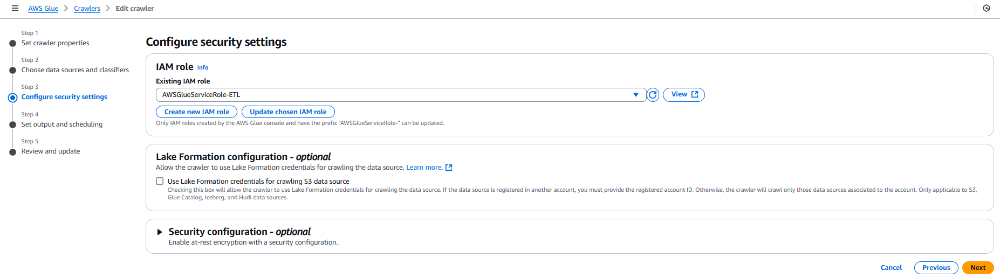
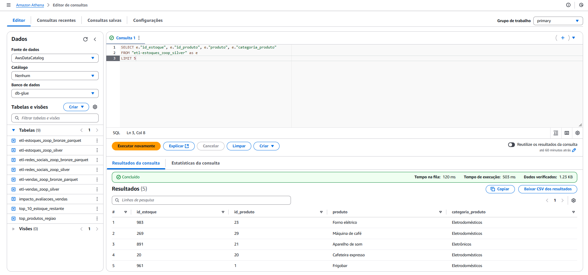
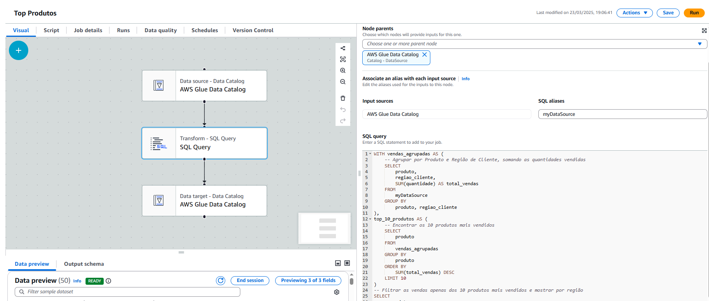
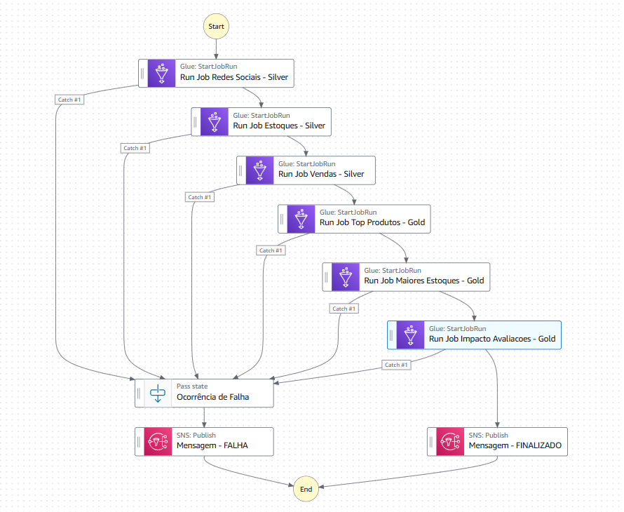

## 🎯 Overview:
This project goal is to build from simple raw data, a complete ETL pipeline in the Cloud. My goal is to explore the benefits of a Medallion Architecture, in an enterprise context, where I need to provide a simple, yet straight-forward way of accessing core business information, without losing flexibility for future changes in context.

To build this pipeline, I started with the business current transaction data (see the Data folder), and built from scratch the pipeline in AWS Cloud Console. From loading the data in S3 and managing access in IAM, to orchestration with Setp Functions, this project was built to run smoothly in cloud only, without the need for maintenance. Furthermore, I explored the functionalities of AWS Glue to craw, catalog, process, and load the data, in order to end-users to have access to reliable insights.

### 🔧 Tech Stack
- **Storage**: Amazon S3 
- **Secrity**: IAM
- **ETL**: AWS Glue Crawler, AWS Glue Data Catalog, AWS Glue ETL Job (Visual Studio e Script Editor)
- **Orchestration**: AWS Step Functions
- **Programming Languages and Packages**: Python, Apache Spark, Athena, SQL

## 📊 Project Architecture:


The Data is loaded to S3 bucket first. Then, in the extraction-processing step, I used Glue Crawler to access the data and infer the Data Schema and create the database, as well as glue Data Catalog to catalog metadata and prepare for the next steps. 

Next, I explored Glue ETL Scripts to manipulate data wih pyspark, to trim and filter data to Silver Layer, and then Glue ETL Visual Studio to run SQL Queries at Silver Layer to create Gold Layer. Also, to orchestrate the process, Step Functions ran the ETLs sequentially, to ensure all the steps are followed before the next.

Lastly, I can query the result using Amazon Athena, that uses the data in the Glue Database. Also, with Amazon Budget, we can stay up to date with future costs that may incur from this pipeline.


## Prerequisites

To run this project, you need an AWS account and permission to manage and create buckets in S3 and ETL jobs in Glue. 


## 1. Upload files to S3


Create an S3 bucket to store raw data, and upload files (\Data). We have now created the copper layer. 

Next, go to the glue service and set up a crawler, pointing to the bucket created. Remember to create an IAM role an give access to get, put, and delete object in the hole bucket.



Paste this JSON in you role policy (managed by the user):
```
{
    "Version": "2012-10-17",
    "Statement": [
        {
            "Effect": "Allow",
            "Action": [
                "s3:GetObject",
                "s3:PutObject",
                "s3:GetObjectAcl",
                "s3:PutObjectAcl",
                "s3:DeleteObject",
                "iam:PassRole"
            ],
            "Resource": [
                "arn:aws:s3:::etl-com-glue/*", #Insert your bucket name!!!
                "arn:aws:iam::{...}:role/service-role/AWSGlueServiceRole-ETL" ##Use your Amazon Resource Name (arn) in place of the '{}'
            ]
        }
    ]
}
```

## 2. Creating ETL job

Back to Glue Crawler, create a database to store raw data and create tables. This will be crucial to querying data in Redshift. 

Now, we finally create the ETL job to transform data to the silver layer! Create another bucket in S3 to store transformed data, then go to Glue ETL Jobs and paste this code in the script editor (\Scripts\Silver). Change database and table names, as well as bucket paths.

After finishing the jobs, we can run queries in athena to retrieve data.

## 3. Athena

We can define a bucket in S3 to store query results. Now, with our data mapped and cataloged, we can run queries at will, as in the example bellow (Some tables in this example are going to be created in next steps)



## 4. Golden Layer and Step Functions

Now, using the visual ETL from glue, we start the process of creating the golden layer (before that, create the tables to catalog results, in the glue database, and bucket in S3 to store it).

The steps are get table from silver layer(Data Catalog), transform data, and write to table.



Do the same for the inventory and Ratings. Lastly, to orchestrate the pipeline, lets use AWS Step Function to run the jobs sequentially:



See that we added a exception handling, which sends an error message to my email using Amazon SNS (Simple Notification Service). That is not the focus of the project, you can forget about it for now.

And that's it! You have a full pipeline you can copy and implement yourself!

### Contact me!
<div> 
  <a href="https://www.linkedin.com/in/daniel-iglesias-melo/" target="_blank"></a> 
 	<a href="https://wa.me/5581989017459" target="_blank"></a>
 <a href= https://discordapp.com/channels/@me/1119691506735906826/" target="_blank"></a> 
  <a href = "mailto:daniel.iglesiascm@gmail.com"></a>
</div>