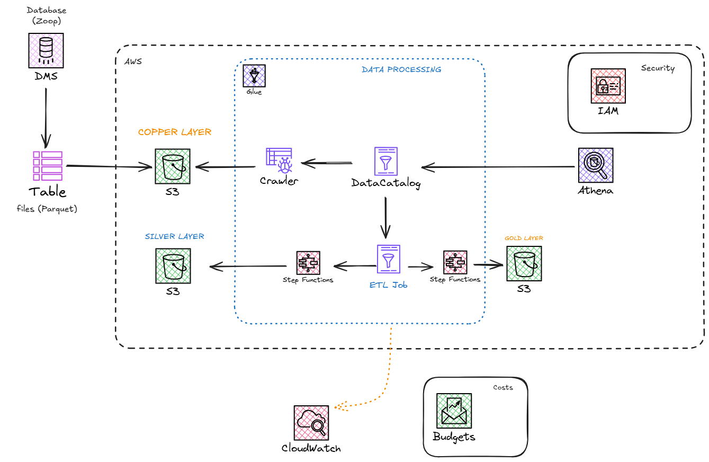

## 🎯 Overview:
This project goal is to build from simple raw data, a complete ETL pipeline in the Cloud. My goal is to explore the benefits of a Medallion Architecture, in an enterprise context, where I need to provide a simple, yet straight-forward way of accessing core business information, without losing flexibility for future changes in context.

To build this pipeline, I started with the business current transaction data (see the Data folder), and built from scratch the pipeline in AWS Cloud Console. From loading the data in S3 and managing access in IAM, to orchestration with Setp Functions, this project was built to run smoothly in cloud only, without the need for maintenance. Furthermore, I explored the functionalities of AWS Glue to craw, catalog, process, and load the data, in order to end-users to have access to reliable insights.

### 🔧 Tech Stack
- **Storage**: Amazon S3
- **Secrity**: IAM
- **ETL**: AWS Glue Crawler, AWS Glue Data Catalog, AWS Glue ETL Job (Visual Studio e Script Editor)
- **Orchestration**: AWS Step Functions
- **Programming Languages and Packages**: Python, Apache Spark, Athena, SQL

## 📊 Project Architecture:

The Data is loaded to S3 bucket first. Then, in the extraction-processing step, I used Glue Crawler to access the data and infer the Data Schema and create the database, as well as glue Data Catalog to catalog metadata and prepare for the next steps. 

Next, I explored Glue ETL Scripts to manipulate data wih pyspark, to trim and filter data to Silver Layer, and then Glue ETL Visual Studio to run SQL Queries at Silver Layer to create Gold Layer. Also, to orchestrate the process, Step Functions ran the ETLs sequentially, to ensure all the steps are followed before the next.

Lastly, I can query the result using Amazon Athena, that uses the data in the Glue Database. Also, with Amazon Budget, we can stay up to date with future costs that may incur from this pipeline.

## Prerequisites

To run this project, you need an AWS account and permission to manage and create buckets in S3 and ETL jobs in Glue. 

### Contact me!

 
   
 	
  
  

